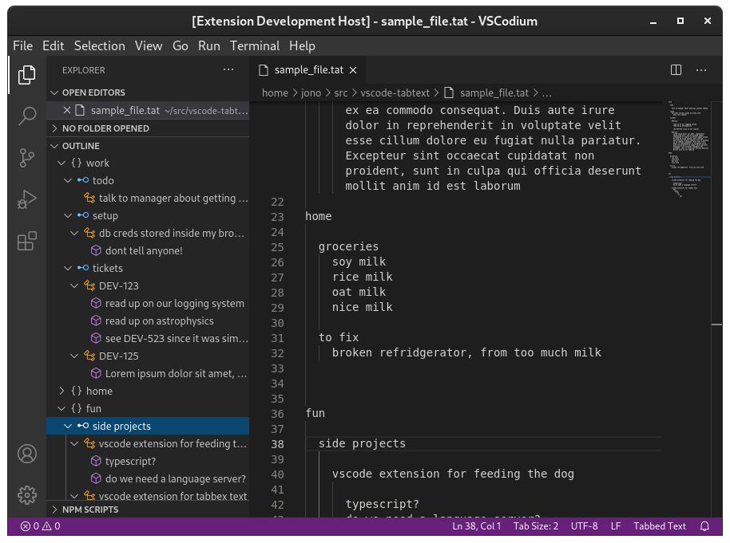

# Tabbed Text file extension

Do you have text files that are formatted by deep tabs and nothing more? I take a lot of notes this way, so I wanted to create some tooling around it.

## Motivation for tabbed file format

In this file format everything is a list, and list membership is denoted by tab level. Nothing more to it. There is no need to differentiate between headings, paragraphs, or even types of lists.

I tried using both Markdown and OrgMode for note taking, but they offered limited nesting depth and they were too semantic for my needs.

I made this plugin to help manage the hierarchical navigation for these types of files. Use the VSCode outline view and set the language mode to 'Tabbed Text' or use the file extension '.tat'.

## Use

To use the VSCode outline view, set the language mode to 'Tabbed Text' or use the file extension '.tat'. At this point it only implments outline view (no syntax highlighting, etc).

## Demo

## Developing on the extension

- Run `npm install` in terminal to install dependencies
- `vscodium .`
- F5 to run the extension in a new window
- In the new window open the included sample_file.tat and make sure the 'Outline' pane is visible.

## Todo

- Make max_level configurable
- Make icons configurable
- See if any overlap with treenotation.org
- Syntax highlighting?
